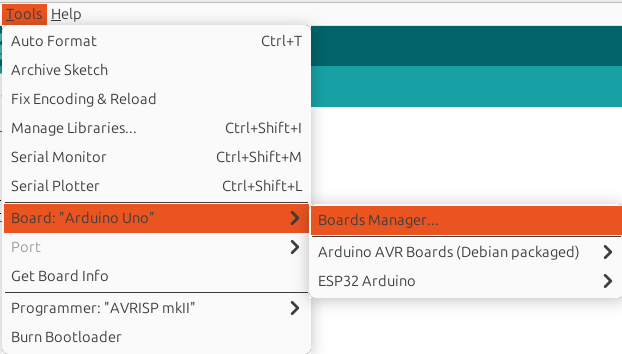

# Pruebas de Ejecucion en ESP32

## Practico 
Conseguir un esp32 o cualquier procesador al que se le pueda cambiar la frecuencia.
Ejecutar un código que demore alrededor de 10 segundos. Puede ser un bucle for con sumas de enteros por un lado y otro con suma de floats por otro lado.
¿Qué sucede con el tiempo del programa al duplicar (variar) la frecuencia ? 

Al duplicar la frecuencia esperamos que se duplique la cantidad de instrucciones por segundo, pero es posible que no sea exactamante lineal

## Prerequisitos
* Computadora con sistema operativo basado en linux
* Placa de desarrollo ESP32
* Cable Usb

## Planificacion Incremental
El desarrrolo es simple, pero aun iremos construyendo el programa paso a paso
1. Hola Mundo
2. Crear un programa que demore al menos 10 segundos
3. Ejecutar el programa con diferentes velocidad de procesador

## Hola Mundo
### Intalacion del entorno
* Podemos usar el IDE de Arduino para esta placa
```bash
sudo apt install arduino
```
* solo hay que configurarlo adecuadamente, en Additioanal Boards Manager URLs con la URL `https://dl.espressif.com/dl/package_esp32_index.json` 


* Buscamos los archivos necesarios para utilizar nuestra placa desde. Asegurarse de elegir la ESP32 de Expressif System 



<br>

## Primer programa
Aqui configuaramos la comunicacion y un programa de bienvenida
```arduino 
void setup() {
  // Inicializamos la comunicación serie a 115200 baudios
  Serial.begin(115200);
  
  Serial.println("¡Configuración lista!");
}
```
luego mostramos el clasico Hola y esperamos 1 ssegundo, sino los mensajes se empiezan a acumular
```arduino
void loop() {
  // Imprimir mensaje en el monitor serie
  Serial.println("Hola Mundo desde ESP32");
  delay(1000); // Esperar 1 segundo
  
}
```
